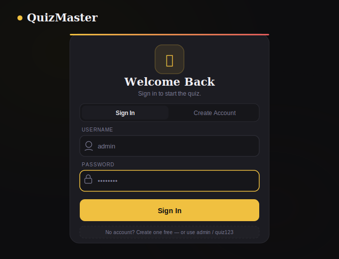
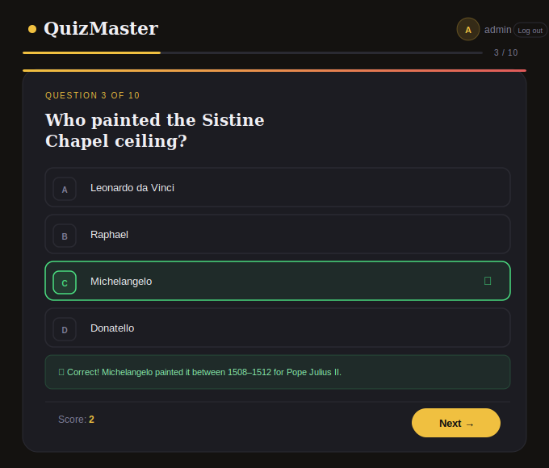
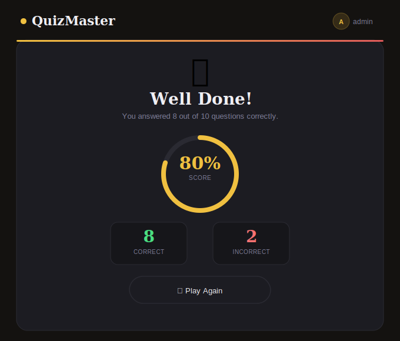

# 🧠 QuizMaster

> A sleek, interactive quiz app with multi-user authentication, live score tracking, and animated results — built with pure HTML, CSS & JavaScript. No frameworks. No dependencies. Just open and play.


---

## 📸 Screenshots

<table>
  <tr>
    <td align="center"><b>🔐 Login Screen</b></td>
    <td align="center"><b>📝 Quiz Screen</b></td>
    <td align="center"><b>🏆 Results Screen</b></td>
  </tr>
  <tr>
    <td></td>
    <td></td>
    <td></td>
  </tr>
</table>

---

## ✨ Features

- 🔐 **Multi-User Auth** — Sign in or register your own account with full validation
- 📝 **10 Quiz Questions** — Multiple-choice with instant feedback & explanations
- 📊 **Live Score Tracking** — Real-time score counter updates as you play
- 🏆 **Animated Results Screen** — Circular score ring, trophy, correct/incorrect stats
- 🌙 **Dark UI Design** — Premium dark theme with gold accents and smooth transitions
- ⌨️ **Keyboard Shortcuts** — Press `A`–`D` or `1`–`4` to answer, `Enter` to advance
- 📱 **Responsive** — Works on desktop, tablet, and mobile
- 📁 **Clean Code Structure** — Separated into `index.html`, `style.css`, `script.js`

---

## 🚀 Getting Started

### 1. Clone the repository

```bash
git clone https://github.com/YOUR_USERNAME/quizmaster.git
cd quizmaster
```

### 2. Open in browser

Just open `index.html` — no build tools, no npm install, no server needed.

```bash
# On Mac
open index.html

# On Windows
start index.html

# Or simply drag index.html into your browser
```

### 3. Login & Play

Use the built-in demo account or create your own:

| Username | Password |
|----------|----------|
| `admin`  | `quiz123` |

Or click **"Create Account"** to register with your own username and password.

---

## 📁 Project Structure

```
quizmaster/
├── index.html              # App structure & markup
├── style.css               # All styles, animations, responsive rules
├── script.js               # Quiz logic, auth, score tracking
├── screenshots/
│   ├── login.svg           # Login screen preview
│   ├── quiz.svg            # Quiz screen preview
│   └── results.svg         # Results screen preview
└── README.md               # You're reading it!
```

---

## 🎮 How to Play

1. **Sign in** or **create a new account**
2. Read each question carefully — 10 questions per round
3. Click an answer (or use keyboard shortcuts)
4. Get instant feedback with an explanation
5. Hit **Next** to move to the next question
6. See your **final score** with a breakdown at the end
7. Hit **Play Again** to restart!

---

## ⌨️ Keyboard Shortcuts

| Key | Action |
|-----|--------|
| `A` / `1` | Select option A |
| `B` / `2` | Select option B |
| `C` / `3` | Select option C |
| `D` / `4` | Select option D |
| `Enter` / `Space` | Go to next question |

---

## 🛠️ Tech Stack

| Technology | Usage |
|------------|-------|
| **HTML5** | Structure & markup |
| **CSS3** | Styling, animations, responsive layout |
| **Vanilla JavaScript** | Quiz logic, auth, DOM manipulation |
| **Google Fonts** | Playfair Display + DM Sans typography |

---

## 🔧 Customization

### Add your own questions
Open `script.js` and edit the `questions` array:

```js
const questions = [
  {
    q: "Your question here?",
    opts: ["Option A", "Option B", "Option C", "Option D"],
    ans: 0,  // index of the correct answer (0 = A)
    explain: "Explanation shown after answering."
  },
];
```

### Add more users
In `script.js`, edit the `USERS` object:

```js
var USERS = {
  admin: { password: 'quiz123', display: 'Admin' },
  john:  { password: 'pass123', display: 'John'  },
};
```

---

## 🌟 Show Your Support

If you found this helpful:

- ⭐ **Star this repo** to show support
- 🍴 **Fork it** and build your own version
- 🐛 **Open an issue** if you find a bug
- 💡 **Submit a PR** if you have an improvement

---

## 📄 License

This project is open source and available under the [MIT License](LICENSE).

---

<p align="center">Built with ❤️ using vanilla HTML, CSS & JavaScript</p>
